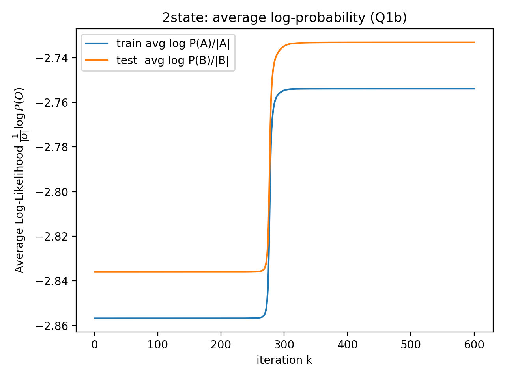
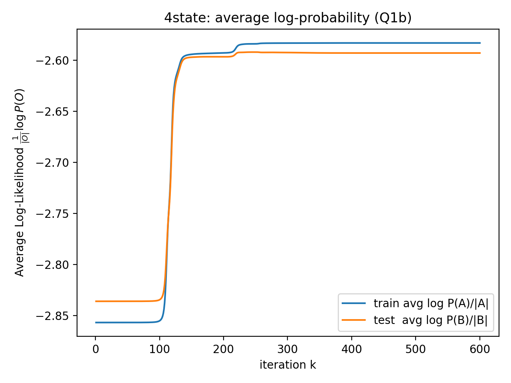
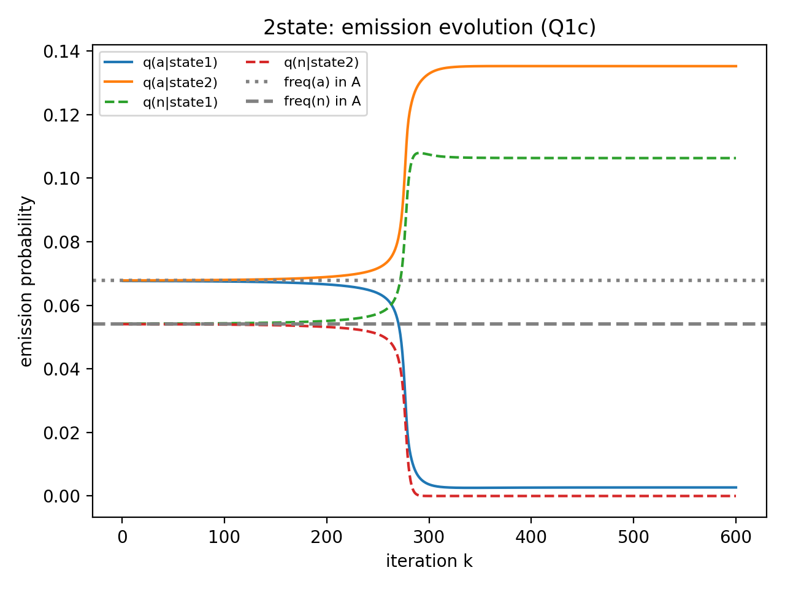
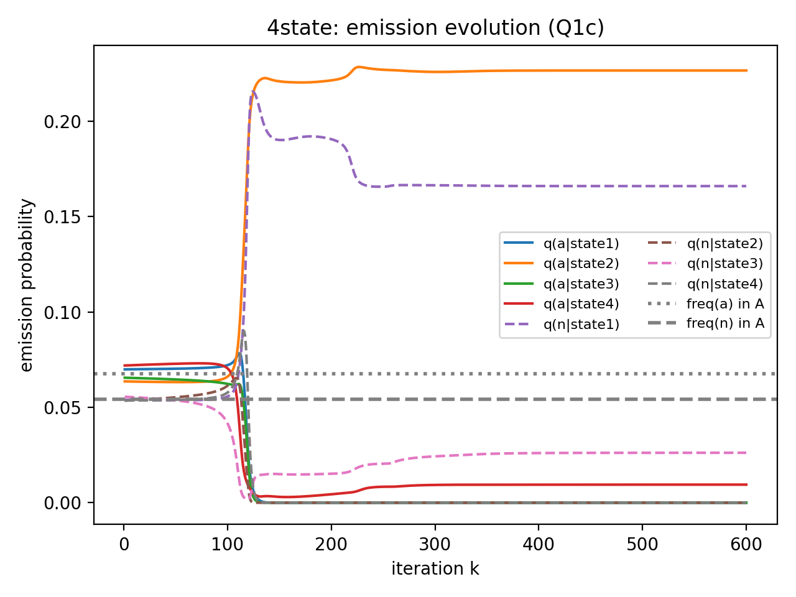

# 🔍 Hidden Markov Model Text Analysis Project

## 🌟 The Big Picture: Uncovering Hidden Patterns in Text

Imagine you're trying to understand how someone writes. You can see the words and letters they use, but what if there are invisible "styles" or "moods" behind their writing that influence every choice? That's exactly what **Hidden Markov Models (HMMs)** help us discover.

HMMs are like smart detectives that look at sequences of data—like text—and figure out the hidden patterns that make those sequences make sense. In this project, we use HMMs to analyze written language, revealing how different underlying "states" (think of them as writing styles or topics) shape the words and letters we see.

This isn't just about technology—it's about understanding how patterns work in the real world. From predicting weather patterns to analyzing speech, HMMs help us see the invisible forces that drive what we observe. Our project shows how these mathematical tools can automatically learn and reveal meaningful structures in everyday text.

## ✨ What Makes This Project Special

- 🤖 **Automatic Learning**: The models start with no knowledge and learn patterns entirely from data
- 🔍 **Pattern Discovery**: They find hidden structures that even humans might not notice
- 🌍 **Real-World Application**: Shows how abstract math can solve practical problems
- 📊 **Visual Insights**: Creates charts that make complex ideas easy to understand

## 🤖 Understanding Hidden Markov Models (Simply)

Think of HMMs like this:

- 🕵️ **Hidden States**: Secret "contexts" that influence what happens (like different writing styles)
- 👀 **Visible Observations**: What we can actually see (the letters and words)
- 🔄 **State Changes**: How the hidden contexts shift over time
- 📤 **Emission Rules**: What each hidden state is likely to produce

For example, one state might prefer formal words, another casual ones. The model learns these preferences automatically from text examples.

## 🎯 Project Goals

This project demonstrates how HMMs can:
- 📚 Learn meaningful patterns from text data without being told what to look for
- ⚖️ Show the difference between simple (2-style) and complex (4-style) writing models
- 📈 Create visual stories of how learning happens over time
- 🧠 Reveal what different "states" in writing look like through their letter preferences

## Technical Implementation: How We Built It

### 💻 The Core Engine (hmm.py)

Our HMM class implements the mathematical heart of these models:
- 🔄 **Forward-Backward Algorithm**: Calculates probabilities of sequences
- 📈 **Baum-Welch Learning**: An "expectation-maximization" method that improves the model with each iteration
- 🔢 **Log-Space Math**: Prevents numerical problems when dealing with very small probabilities
- ⚙️ **Parameter Updates**: Automatically adjusts transition and emission probabilities to better fit the data

### 🚀 The Main Process (main.py)

The main script orchestrates everything:
- 📝 **Data Preparation**: Converts text into numerical sequences (26 letters + space = 27 symbols)
- 🏗️ **Model Creation**: Builds both simple 2-state and complex 4-state HMMs
- 🔄 **Training Loop**: Runs 600 learning iterations to optimize each model
- 📊 **Analysis Generation**: Creates charts and reports showing what the models learned

### 🔑 Key Technical Features

1. **🧹 Smart Text Processing**:
   - Converts all text to lowercase for consistency
   - Maps letters and spaces to numbers (a=0, b=1, ..., z=25, space=26)
   - Filters out any unexpected characters

2. **🎓 Model Training Strategy**:
   - **2-State Model**: Starts with carefully chosen initial settings
   - **4-State Model**: Begins with random settings to explore more complex patterns
   - **600 Iterations**: Gives each model plenty of time to learn optimal patterns

3. **📈 Comprehensive Analysis**:
   - Tracks learning progress with probability curves
   - Shows how letter preferences evolve in each state
   - Analyzes how states transition between each other
   - Tests models on new text to check generalization

### 📊 Data and Setup

- **📚 Training Data**: `textA-1.txt` - The text the models learn from
- **🧪 Test Data**: `textB-1.txt` - New text to evaluate how well models generalize
- **📁 Output**: Charts and analysis saved in the `plots/` directory

## ▶️ How to Run the Project

1. Make sure you have Python 3.x with NumPy and Matplotlib installed
2. Put your text files in the `data/` folder
3. Run: `python main.py`

The script will automatically:
- Process the text data
- Train both HMM models
- Generate analysis charts
- Print detailed results

## 📈 My Learning: Results and Insights

The project generates several key insights through comprehensive visualizations:

### 📈 1. Learning Progress
These plots show how the model's predictive ability improves over 600 training iterations:

**2-State HMM Learning Curve**  

**4-State HMM Learning Curve**  

The curves track average log-probability on both training (text A) and test (text B) data, demonstrating how the model learns to better predict text patterns.

### 🔍 2. State Discovery Through Emission Evolution
These visualizations reveal how different hidden states specialize in emitting different letters:

**2-State HMM: Emission Probabilities for 'a' and 'n'**  

**4-State HMM: Emission Probabilities for 'a' and 'n'**  

The plots show how emission probabilities for letters 'a' and 'n' evolve across states during training. Horizontal lines indicate the actual frequency of these letters in the training data.

### ⚖️ 3. Model Complexity Comparison
- **2-State Model**: Simple binary classification of text patterns
- **4-State Model**: More complex representation allowing for richer pattern discovery
- **Generalization**: Test performance shows how well learned patterns apply to unseen text

### 🧠 4. State Interpretation
The console output provides detailed analysis of:
- Which letters each state prefers to emit
- Transition probabilities between states
- How states differentiate themselves through emission patterns

## 🌟 Why This Matters

HMMs are fundamental to many modern technologies:
- 🎤 Speech recognition systems
- 📝 Natural language processing
- 🧬 Bioinformatics (DNA sequence analysis)
- 💰 Financial modeling
- 👋 Gesture recognition

This project provides a hands-on introduction to these powerful concepts, showing how mathematical models can automatically discover meaningful patterns in real-world data.

## 🚀 Future Extensions

The framework can be extended to:
- 🌍 Analyze different languages or writing styles
- 🏗️ Incorporate more complex state structures
- 🎵 Apply to other sequence data (music, sensor readings, etc.)
- 🔬 Implement advanced variants like Hierarchical HMMs
